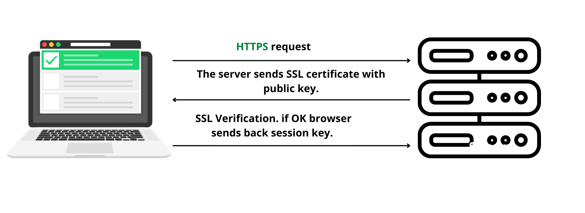

# Atypon Java and DevOps Training  
Atypon Final Project Using Spring, Spring Security, Thymeleaf with Spring extras security extension. The same project was implementd first using traditional MVC Servlets/ JSPs click [here](https://github.com/MamounH/InMemoryServletWebProject) to view it.

To make the Web application Maintainable, Extendable and Scalable, SOLID principles, Design Patterns, ACID Criteria, Clean Code principles and Effective Java items
were applied. Also to view the full detailed project report please click [here](https://github.com/MamounH/InMemorySpringProject/blob/master/ProjectReport/ProjectReport.pdf)!

## Overview

The system has 3 levels of users: Students, Instructors, Admins. 

**Administrator**: 
- Add, Update, Delete, View all users.

**Editor**: 
- Add, Update, Delete, View all Books records.
- Add, Update, Delete, View all Quotes records.

**Viewer**: 
- Can only view Books/Quotes.

## Technology Stack
- Java 16
- Spring Core, Boot, MVC, Security
- Thymeleaf rendring engine and Bootstrap CSS framework for the front-end, with Thymeleaf extras for security. 
- Junit
- Maven Build Tool
- Jenkins for CI/CD
- GitHub for VS
- AWS and Docker for deployment.
- Datadog for montioring. 
- SSL digital certificate to encrypt trafic and help to secure information such as users data.

DevOps Pipeline.

## Database Architecture

i have built a three-tier architecture. It’s the most widely used architecture to design a DBMS. This architecture will separate and organize the application into three tiers:  

One of the main benefits of this architecture that we have a separation of
functionality we can have each tier on a separate server platform.
Also, we can develop each tier simultaneously without effecting or impacting
other tiers. The security will be maximised because the presentation tier and data
tier cannot communicate directly because the application tier is working as a
firewall preventing incorrect or malicious data to be inserted to the database. 

## Concurrent Access to database records

The sole purpose of this project is to build every thing from scratch that’s
why I avoided using ConcurrentHashMap in the first version and in this
version of this project too. AccessSynch class is used to synchronize access
to the database records using Reentrant ReadWrite Locks.

As we can see i have used Reentrant ReadWrite lock for each object in a
HashMap so it can be used when multiple threads are using the database thus
allowing concurrent access instead of locking the whole table.

The threadQueue HashMap will store the number of threads that are using or
are in queue to use the record in the locks HashMap, so when there are no
threads using the record, we can safely remove the record from the HashMap. 

A lock object is also used to synchronize access to parts of code in the
AccessSynch class that will be called only by one thread at a time. i.e., getting
a record lock thus preventing two threads from acquiring the lock at the same time. 

## Junit 

According to Michael feathers in his book working Effectively with Legacy Code he defines a legacy code as a code without tests, There’s no excuse to not write tests, many test frameworks out there, in this
system I used JUnit testing framework and manual testing. 

## AWS 

Amazon Web Services were used in the project, as several instances were created for Jenkins Server and Web Servers for both versions of the project.

## Jenkins

As Jenkins provides CI/CD, I think this one of the most important phases in DevOps
pipeline, when we reach this stage that means that a build is ready and safe for
deployment for the next stage. Since each code has passed a bunch of manual and
unit testing. So, we will be confident about the deployment because the likelihood
of issues or bugs are very low. 

I have configured Jenkins with many plugins, i.e., GitHub, Maven, Datadog. 

Jenkins AWS Server Status:

Every Failure i have encountered was a closer step to sucess....

## Datadog

Datadog will be collecting data and providing analytics that will be very helpful for future decisions i.e., Performance, Errors and more. 

Datadog Infrastructure List:

AWS EC2 instance analytics on Datadog: 

Also, to do more observation and to monitor the pipeline itself I configured and connected the Jenkins server itself to Datadog itself. 

 Datadog Agent status on Jenkins Server:

## SSL Certificate

No web application is safe unless we have SSL certificate because the data and
user credentials that is in transit can be easily intercepted and decoded, since we
send the user credentials to the web application, we shouldn’t send them in the
clear, because if we do, we will compromise users’ data to intruders. 

To enable the website to move from HTTP to HTTPS i created my own SSl Certificate using PKCS#12 as the binary format for storing the certificate chain and the private key in a single, encryptable file. RSA (Rivest–Shamir–Adleman) as the key algorithm with key size of 2048

## Canva Pro and Creately 
These websites have nothing to do with the technical detailes of the project but they did a great a job helping me to design nice diagrams and UML diagrams for the project report that was very informative. 

## Screenshots Samples

  
  
  

  
  
  

  
  
  

  
  
  

  
  
  

For more screen shots please click [here!](/Screenshots/)

### Contact

Mamoun Abu Koush - :e-mail: Mamounhayel@gmail.com

LinkedIn: [Mamoun Hayel](https://www.linkedin.com/in/mamounhayel/)

